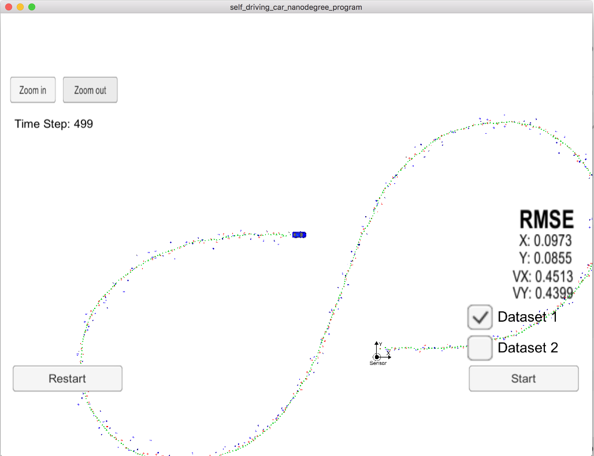

# Extended Kalman Filter Project
Self-Driving Car Engineer Nanodegree Program

## Overview
The aim of this project is the implementation of an Extended Kalman Filter in C++ to detect the postion and the velocity of a moving object (here a bicycle) in 2D space.

## Results
The RMSE results of the tracking algorithm meet the challenges of [.11, .11, 0.52, 0.52] as long as both, the radar data and the lidar data are used. If only one of the sensor data sets are used the results are significantly worse and do not meet the challenge whereby lidar data only leads to better results than radar data.

The tables below show the RMSE result that were obtained by this implementation.

#### Dataset 1:

|      | Radar and Lidar data | Lidar data only | Radar data only |
| ---: | :------------------: | :-------------: | :-------------: |
|    x |        0.0973        |     0.1838      |     0.2319      |
|    y |        0.0855        |     0.1542      |     0.3361      |
|   vx |        0.4513        |     0.6051      |     0.5259      |
|   vy |        0.4399        |     0.4858      |     0.6987      |

#### Dataset 2:

|      | Radar and Lidar data | Lidar data only | Radar data only |
| ---: | :------------------: | :-------------: | :-------------: |
|    x |        0.0726        |     0.1656      |     0.2439      |
|    y |        0.0965        |     0.1581      |     0.3375      |
|   vx |        0.4216        |     0.6063      |     0.6035      |
|   vy |        0.4932        |     0.4955      |     0.8174      |

The image below shows the tracking results using radar data and lidar data of dataset 1:

 

### Improvements to the Starter Code

The following improvements to the provided starter code have been made:

- make all class members private (having public class members is bad coding style and forbidden by MISRA rules.)
- calculate the transposed matrix of H when initializing H
- calculate the identity matrix I when initializing the state vector x
- move the update of matrices F and Q to function Predict() and pass the time difference and the noise values as parameters to Predict()
- pass the matrix R to Update() and UpdateEKF() 
- move the common parts of Update() and UpdateEKF() to DoUpdate() and pass the matrices H respectivly Hj and their transposed matrices as parameter to DoUpdate()

---

## Dependencies

* cmake >= 3.5
  * All OSes: [click here for installation instructions](https://cmake.org/install/)
* make >= 4.1 (Linux, Mac), 3.81 (Windows)
  * Linux: make is installed by default on most Linux distros
  * Mac: [install Xcode command line tools to get make](https://developer.apple.com/xcode/features/)
  * Windows: [Click here for installation instructions](http://gnuwin32.sourceforge.net/packages/make.htm)
* gcc/g++ >= 5.4
  * Linux: gcc / g++ is installed by default on most Linux distros
  * Mac: same deal as make - [install Xcode command line tools](https://developer.apple.com/xcode/features/)
  * Windows: recommend using [MinGW](http://www.mingw.org/)

## Basic Build Instructions

1. Clone this repo.
2. Make a build directory: `mkdir build && cd build`
3. Compile: `cmake .. && make` 
   * On windows, you may need to run: `cmake .. -G "Unix Makefiles" && make`
4. Run it: `./ExtendedKF `
